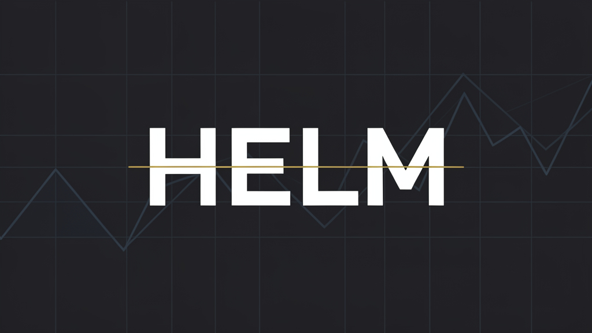

<p align="center">
  
</p>

<h1 align="center">HELM</h1>
<p align="center"><b>Autonomous AI Trading for Perpetual Futures</b></p>

<p align="center">
  <a href="#architecture">Architecture</a> &nbsp;•&nbsp;
  <a href="#features">Features</a> &nbsp;•&nbsp;
  <a href="#stack">Stack</a> &nbsp;•&nbsp;
  <a href="#quickstart">Quick Start</a> &nbsp;•&nbsp;
  <a href="#license">License</a>
</p>

---

## Overview

**Helm** is an autonomous trading system for **Hyperliquid perpetual futures** that generates trade signals from large language models, evolves its own prompts through genetic selection, and executes through a twelve-circuit risk harness. It runs headless 24/7 with a lightweight web dashboard and Telegram alerts.

**No paid data APIs.** No JavaScript build pipeline. No black-box strategies. Every signal, every parameter, every failure is logged, backtested, and selectable for improvement.

---

## Architecture

```
┌────────────────────────────────────────────────────────┐
│                 Market Data Layer                            │
│   Hyperliquid API → Funding · OI · Premium · L2 Book        │
└────────────────────────────────────────────────────────┘
                              │
                              ▼
┌────────────────────────────────────────────────────────┐
│              LLM Signal Engine (Darwinian)                  │
│  Prompt Pool → Backtest → Fitness → Crossover/Mutation      │
│  → Select Top → Deploy → Repeat every N generations          │
└────────────────────────────────────────────────────────┘
                              │
                              ▼
┌────────────────────────────────────────────────────────┐
│              Execution Engine                                │
│  Signal → Sizer → Risk Guard (12 breakers) → HL API        │
│  → Position Tracker → TP/SL/Trailing → SQLite Log            │
└────────────────────────────────────────────────────────┘
                              │
              ├──────────────┐
              │                │
              ▼                ▼
┌──────────────┐ ┌──────────────┐
│   Telegram Bot  │ │   Web UI        │
│   /status       │ │   Overview      │
│   /stop         │ │   Positions     │
│   /risk         │ │   Risk Meters   │
└──────────────┘ └──────────────┘
```

---

## Features

| Domain | Feature | Description |
|--------|---------|-------------|
| **Signals** | LLM-Powered Generation | Prompt engineering pipeline that feeds market microstructure context to an LLM and receives structured trade signals with confidence scores |
| **Evolution** | Darwinian Prompt Selection | Population of 64 prompts. Each generation: backtest all, rank by Sharpe, mutate/crossover top 20%, repeat. Self-improving alpha. |
| **Risk** | 12-Circuit Breaker Harness | Max drawdown, daily loss limit, concentration limits, volatility filter, correlation check, funding-rate filter, and more. Any trip halts trading. |
| **Execution** | Hyperliquid Perps | Native integration with Hyperliquid API. Supports both paper trading (simulated fills) and live trading. |
| **Data** | Zero Paid APIs | Uses Hyperliquid L2 book + public endpoints (alternative.me fear & greed, cryptocurrency.cv funding). No Binance/Coinbase API keys required. |
| **Alerts** | Telegram Bot | Real-time trade alerts, risk breaker notifications, daily P&L summaries, emergency `/stop` command |
| **Dashboard** | Web UI | FastAPI + Jinja2 dark-theme dashboard. No npm, no build step. View positions, equity curve, signal history, circuit breaker status. |
| **Security** | Secrets Isolation | All credentials in `.env`. Audit log of every signal, trade, and config change. Input validation on all external data. |

---

## Stack

| Layer | Technology |
|-------|-----------|
| Language | Python 3.11+ |
| Web Framework | FastAPI |
| Templating | Jinja2 |
| Styling | Vanilla CSS (dark theme, no build step) |
| Database | SQLite (positions, trades, signals, logs) |
| Exchange API | Hyperliquid REST + WebSocket |
| LLM | OpenRouter-compatible (Claude, GPT-4, Qwen, etc.) |
| Messaging | python-telegram-bot |
| Testing | pytest |

---

## Quick Start

### 1. Clone

```bash
git clone https://github.com/APfincode/helm.git
cd helm
```

### 2. Install

```bash
python -m venv .venv
source .venv/bin/activate  # Windows: .venv\Scripts\activate
pip install -e .
```

### 3. Configure

```bash
cp .env.example .env
# Edit .env with your credentials:
#   HYPERLIQUID_PRIVATE_KEY=...
#   OPENROUTER_API_KEY=...
#   TELEGRAM_BOT_TOKEN=...
#   TELEGRAM_CHAT_ID=...
```

### 4. Run Validation

```bash
python validate_phase4.py  # Evolver
python validate_phase5.py  # Risk
python validate_phase6.py  # Execution
python validate_phase7.py  # Microstructure
python validate_phase8.py  # Telegram + Web UI
```

### 5. Launch

```bash
# Paper trading (simulated)
python -m src.main --mode paper

# Live trading (real money)
python -m src.main --mode live
```

### 6. Dashboard

```bash
# In a separate terminal
python -m src.webui.server
# Open http://localhost:8080
```

---

## Directory Structure

```
helm/
├── src/
│   ├── backtest/          # Historical backtest engine with fee modeling
│   ├── config/            # YAML config loader and pydantic models
│   ├── data/              # OHLCV fetcher + SQLite cache
│   ├── evolver/           # Darwinian prompt evolution
│   ├── execution/         # Trade execution, paper trading, position tracker
│   ├── llm/               # LLM client, prompt engine, signal generator
│   ├── market_context/    # Funding, OI, premium, macro context builder
│   ├── risk/              # Position sizer + 12-circuit breaker harness
│   ├── security/          # Auth, audit logger, input validator, rate limiter
│   ├── strategy/          # Base strategy interface + examples
│   ├── telegram/          # Alert bot + command handlers
│   └── webui/             # FastAPI server + state provider
├── config/              # Runtime YAML configs
├── templates/           # Jinja2 HTML templates
├── static/              # CSS + JS (no build step)
├── tests/               # Unit tests
├── scripts/             # CLI utilities (backtest, evolve, signal)
└── docs/                # Architecture and research notes
```

---

## Circuit Breakers

| # | Breaker | Trigger | Action |
|---|---------|---------|--------|
| 1 | Max Drawdown | Portfolio ↓ 20% from peak | Halt all new positions |
| 2 | Daily Loss Limit | Daily P&L ↓ 5% of equity | Halt for 24h |
| 3 | Concentration Limit | Single position > 25% equity | Reject sizing |
| 4 | Volatility Filter | ATR > 3σ above mean | Reduce size 50% |
| 5 | Correlation Check | Position correlates > 0.8 with existing | Reject |
| 6 | Funding Rate | Annualized funding > 100% | Avoid longs |
| 7 | Liquidity Filter | Spread > 50 bps | Reject |
| 8 | Cooldown | Position closed within 5 min | Block re-entry |
| 9 | Max Positions | > 5 open positions | Reject new signals |
| 10 | Leverage Cap | Effective leverage > 10x | Reject |
| 11 | API Error Rate | > 5 errors in 1 min | Pause 10 min |
| 12 | Manual Override | `/stop` command received | Immediate full halt |

---

## Research & Methodology

See `docs/` for detailed research:

- `threat-model.md` — Security architecture and attack surface analysis
- `phase7_research_sentiment.md` — Perpetual market microstructure analysis (funding, OI, premium)

Key finding: **funding-rate arbitrage + OI divergence** consistently outperforms social-sentiment signals on Hyperliquid. Helm's microstructure context builder focuses on these exchange-native alpha sources.

---

## Telemetry

Helm is designed to be **telemetry-free by default**. No analytics, no tracking, no external logging services. All data stays local:

- SQLite database at `data/helm.db`
- Audit logs at `logs/audit.log`
- Config files in `config/*.yaml`

---

## License

MIT License — see [LICENSE](./LICENSE)

---

<p align="center">
  <sub>Built for Hyperliquid. Evolved by LLMs. Guarded by 12 breakers.</sub>
</p>
